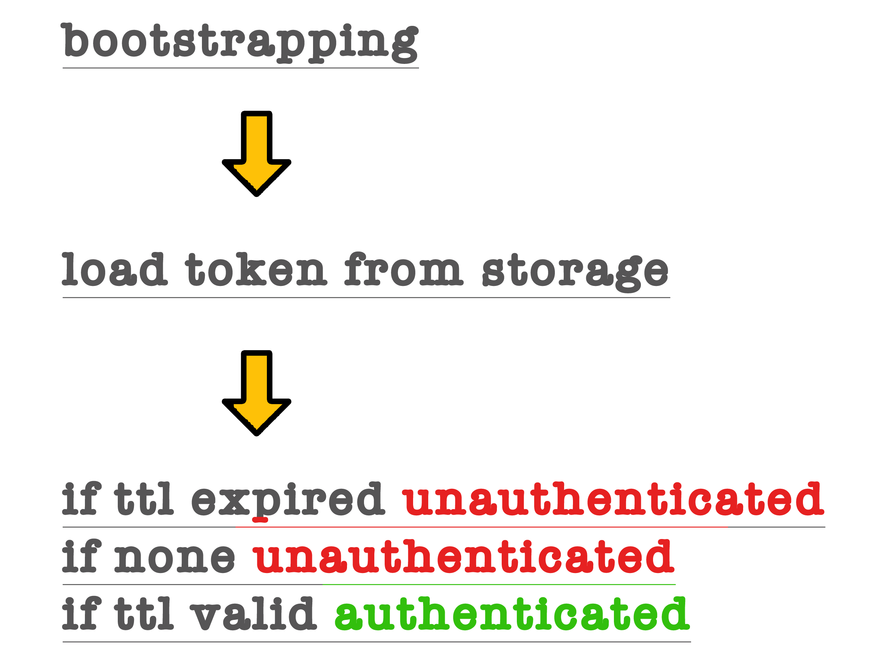

<p style="text-align: Left;"></p>

## Overview

This project is a React Native mobile application that implements a basic authentication flow controlling access to the rest of the app. The application simulates server authentication using a mock API response.

The architecture emphasizes clean separation of concerns. It uses context-based auth state management, reducers, and service layers. Persistent storage is used to maintain the session across app restarts, and the app checks token TTL (time-to-live) to determine whether the session is still valid.
When launched, the app does the following:

<br>
## App Flow Diagram
<p style="text-align: Left;"></p>

<br>

<span style="font-size: 140%; font-weight: bold; color: darkGreen;">Command line setup instruction</span>

Yarn setup:

```bash
## STEP 1
git clone https://github.com/rosano-alex/auto-complete-demo.git

## STEP 2
cd auto-complete-demo && yarn

## STEP 3
yarn start
```

NPM setup:

```bash
## STEP 1
git clone https://github.com/rosano-alex/auto-complete-demo.git

## STEP 2
cd auto-complete-demo && npm install

## STEP 3
npm run start
```

<br>
<span style="font-size: 140%; font-weight: bold; color: darkGreen;">Available developer scripts</span>

In the project directory, you can run the following scripts.

| yarn            | NPM                | info                                                                                          |
| --------------- | ------------------ | --------------------------------------------------------------------------------------------- |
| `yarn start`    | `npm run start`    | Runs the app in the development mode and opens [http://localhost:3000](http://localhost:3000) |
| `yarn build`    | `npm run build`    | Builds the optimized app for production to the `build` folder                                 |
| `yarn prettier` | `npm run prettier` | Recursively runs prettier on every file in the src folder                                     |
| `yarn test`     | `npm run test`     | Run project unit tests                                                                        |
